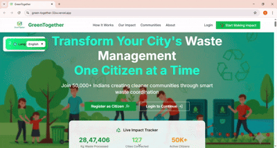
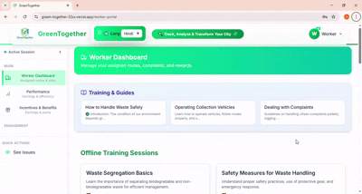
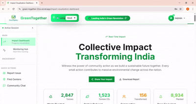

# 🌿 GreenTogether - Smart Waste Management Portal


Welcome to *GreenTogether, the interactive web application designed to make waste management **smart, efficient, and user-friendly* for citizens, workers, and administrators. This project combines cutting-edge frontend technologies, responsive design, real-time tracking, and engaging UI/UX for a seamless experience. <br>
  
A prototype web platform built for **Smart India Hackathon 2025** addressing the problem statement **“Real Life Solutions for Waste Management” (SIH25060)**.  
This demo focuses on citizen & worker workflows, city partnerships, reporting, incentives and monitoring to reduce and manage municipal waste.

---

## 🚀 Key Features

### 🌟 Core Functionality
- *React 18* – Modern and fast React with concurrent rendering.
- *Vite* – Ultra-fast dev server and build tool.
- *TailwindCSS* – Utility-first styling with responsive design.
- *Redux Toolkit* – Simplified and scalable state management.
- *React Router v6* – Declarative routing.
- *Framer Motion* – Smooth animations.
- *React Hook Form* – Flexible and efficient form handling.

### 📊 Analytics & Visualization
- *Recharts & D3.js* – Interactive charts and visual insights.
- *GPS Tracking* – Real-time monitoring of vehicles and workers.
- *Dashboards* – Metrics, stats, and progress visualization.

### 🧩 User Experience
- Responsive layouts for all devices.
- Interactive *sidebar* and navigation menus.
- Role-based views: *Citizen, **Worker, **Admin*.
- Photo-based reporting and task tracking.

### 🛠 Worker-Oriented Features
- Task assignment and tracking.
- Incentive monitoring.
- Real-time notifications and alerts.
- Easy reporting interface with photo uploads.

---

## 🎥 Live Demo & GIFs

*Watch GreenTogether in action:*

| Landing Page    | Citizen Dahboard | Worker Dashboard | Admin Dashboard |
| --------|-------------|----------------|----------------|
|         |  |  |  |

> GIFs demonstrate interactivity, movable language translator, and real-time updates.

*Or try the live demo:* [🌐 GreenTogether Live](https://green-together-32sx.vercel.app/)<br>

---

## 🔐 Demo Credentials (Quick Login) 
<br>

| Role      | Email                    | Password     |
|-----------| ------------------------ |--------------|
| Citizen   | `citizen@wasteauth.com`  | `citizen123` |
| Worker    | `worker@wasteauth.com`   | `worker123`  |
| Admin     | `admin@wasteauth.com`    | `admin123`   |

---

## 📁 Project Structure

```bash
GreenTogether/
├── build/              # Production build output
├── public/             # Static assets (favicon, logos, etc.)
├── src/
│   ├── assets/         # Images, icons, media
│   ├── components/     # Reusable UI components (ScrollToTop, ErrorBoundary, etc.)
│   ├── context/        # Context API providers
│   ├── layouts/        # Layout wrappers
│   ├── pages/          # Feature-specific pages (Portals, Dashboards, Auth, etc.)
│   ├── services/       # API and service functions
│   ├── styles/         # Global styles & Tailwind config
│   ├── utils/          # Helper utilities
│   ├── App.jsx         # Root component
│   ├── index.jsx       # React entry point
│   └── Routes.jsx      # Application routes
├── package.json        # Dependencies & scripts
├── vite.config.mjs     # Vite configuration
└── README.md
```

---

␣␣

## 🛠 Installation & Quick Start (60 seconds)

1️⃣ Clone the repo

```bash
git clone https://github.com/Soheb04-git/GreenTogether.git
cd GreenTogether
```

2️⃣ Install dependencies

```bash
npm install
# or
yarn install
GeenTogether
```


3️⃣ Run the app
```bash
npm start
# or
yarn start
```
4️⃣ Open your browser

```bash
> Visit http://localhost:5173 to see GreenTogether in action!
```


---


🧭 Adding Routes

Update Routes.jsx:

```bash
import { useRoutes } from "react-router-dom";
import HomePage from "./pages/HomePage";
import WorkerDashboard from "./pages/WorkerDashboard";
import AdminDashboard from "./pages/AdminDashboard";

const ProjectRoutes = () => {
  const element = useRoutes([
    { path: "/", element: <HomePage /> },
    { path: "/worker", element: <WorkerDashboard /> },
    { path: "/admin", element: <AdminDashboard /> },
    // Add more routes here
  ]);

  return element;
};

export default ProjectRoutes;
```

---
<br>

📱 Responsive & Interactive Design

Mobile-first, responsive design using Tailwind breakpoints.

Collapsible sidebars, modals, and tabs.

Smooth animations for buttons, menus, and transitions.

Real-time notifications and alerts for updates.

Adaptive typography and fluid layouts for all devices.


---
<br>

🔧 Configuration

Tailwind Plugins:

Forms, Typography, Aspect Ratio

Container Queries & Fluid Typography

Animation Utilities


Environment variables in .env and .env.local.

Optional: Dark mode toggle.


---
<br>

🌐 Deployment <br>
```bash
npm run build
```
# Deploy to Vercel, Netlify, or GitHub Pages
<br>
💡 Pro Tip: Connect GitHub Actions or Vercel for auto-deploy on every commit.


---
<br>

## 🏅 Badges


 <br>
<br>
<br>
<br>


   


---

<br>

🙏 Acknowledgments <br>
<br>
SIH 2025 Inspiration – Real-world waste management problem solving.

React & Vite – App foundation.

TailwindCSS – Styling and responsive design.

Framer Motion – Interactive animations.

Recharts & D3.js – Data visualizations.


---

<br>

Built with ❤️ for Smart India Hackathon 2025 by Team CODE 4 CAUSE25. .
Designed to make waste management interactive, efficient, and engaging for citizens, workers, and admins.